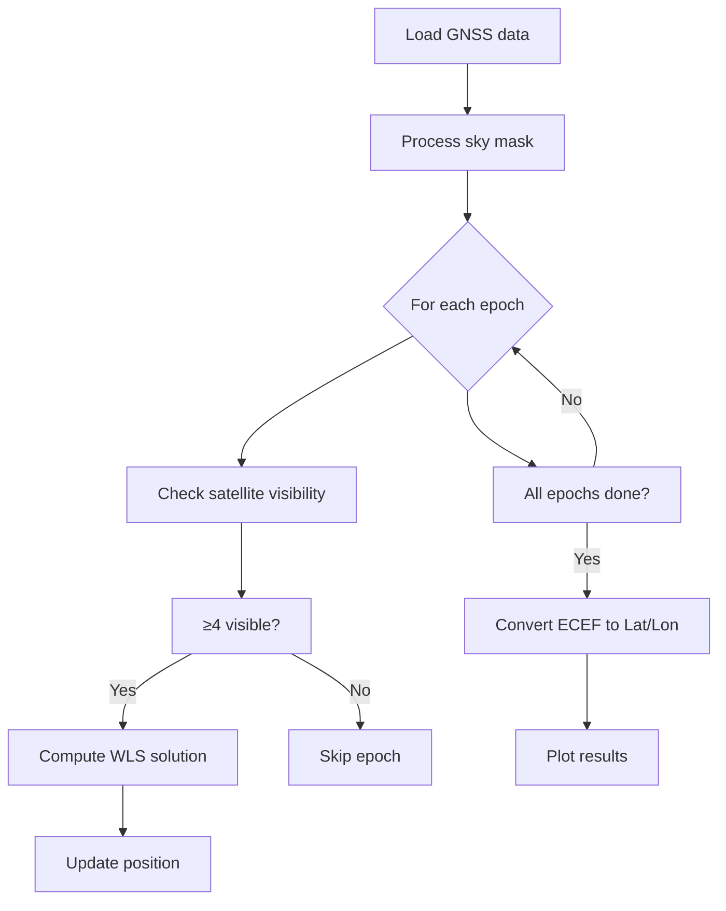
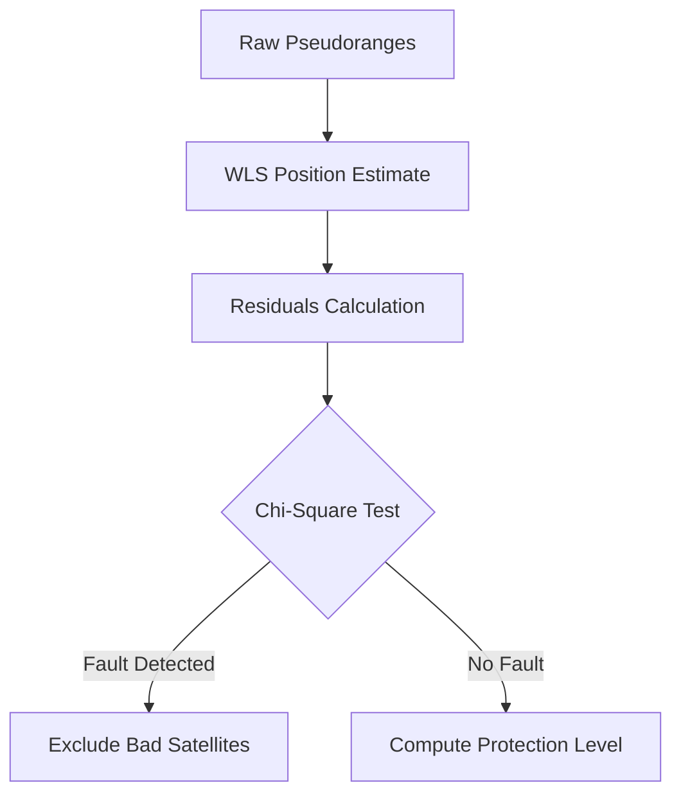

# AAE6102 Assignment2
## Meng Qingyang 23125921r

## Task 1 

> Prompt: In these tasks, I use an open-source prompt repository: **Super Prompt**
Super Prompt (https://github.com/NeoVertex1/SuperPrompt) aims to create an AI system that can continuously evolve, explore complex concepts, and operate at multiple levels of abstraction. It combines elements of mathematics, logic, computer science, and philosophy to create a theoretical framework for infinite expansion and self-improvement.
link: 
Furthermore, I use a website to create detailed promt: https://superprompt.com/
For API address: https://api.siliconflow.cn
API Key: sk-fzguoveoprdatkcmcydffhguntqpphlmnbtrrquudilsagks
I use deepseek-v3 for generating, which I highly recommend.


### **Prompt of task 1**:
You are a research student based in Hong Kong tasked with writing a short essay comparing the pros and cons of various Global Navigation Satellite System (GNSS) techniques for smartphone navigation, focusing on Differential GNSS (DGNSS), Real-Time Kinematic (RTK), Precise Point Positioning (PPP), and PPP-RTK. Follow these detailed instructions to complete this task effectively:
1. Begin with a brief introduction (50-150 words) that outlines the importance of GNSS techniques in modern smartphone navigation, highlighting the critical role they play in ensuring accuracy and reliability.
2. For each of the four GNSS techniques—DGNSS, RTK, PPP, and PPP-RTK:
- Provide a concise overview (50-100 words per technique) explaining its fundamental working principles.
- List at least two advantages and two disadvantages of each technique. Use bullet points for clarity and ease of understanding.
- Compare each technique in terms of accuracy, cost, complexity, and their suitability for use in urban environments like Hong Kong.

3. Synthesize the findings in a comparative analysis (150-250 words), discussing the most effective GNSS technique for smartphone navigation based on the outlined criteria. Consider the specific context of navigating through a dense urban area with complex infrastructural landscapes.

4. Conclude with a summary (50-100 words) that clearly states your chosen GNSS technique for optimal smartphone navigation and justify your choice based on the preceding analysis.

Format:
- Use clear and concise language suitable for an academic audience.
- Avoid technical jargon without explanation to ensure comprehensibility for readers unfamiliar with GNSS technologies.
- Maintain formal essay structure, ensuring paragraphs are logically organized and transitions between sections are smooth.

Ensure that the entire essay is 500–1000 words, adhering strictly to academic standards in terms of grammar and style. Use references where necessary to support your points, aiming for a professional and informative tone throughout the essay.


### **Essay of Task 1: Comparative Analysis of GNSS Techniques for Smartphone Navigation in Urban Environments**

#### **Introduction**
Global Navigation Satellite Systems (GNSS), such as GPS (USA), GLONASS (Russia), Galileo (EU), and BeiDou (China), are essential for precise location-based services in smartphones. While standard GNSS positioning offers reasonable accuracy (within a few meters), advanced techniques like Differential GNSS (DGNSS), Real-Time Kinematic (RTK), Precise Point Positioning (PPP), and PPP-RTK enhance accuracy and reliability—critical factors in dense urban environments like Hong Kong, where tall buildings, signal multipath, and signal obstruction degrade conventional GNSS performance. This essay evaluates these four techniques, comparing their accuracy, cost, complexity, and suitability for smartphone navigation in urban settings.

#### **Comparative Analysis of GNSS Techniques**

**1. Differential GNSS (DGNSS)**
**Overview:** DGNSS improves accuracy by comparing GNSS measurements from a smartphone with those from a nearby fixed reference station, which transmits correction data to eliminate common errors (e.g., atmospheric delays).

**Advantages:**
✔ Achieves sub-meter accuracy (0.5–2 m), suitable for urban navigation.
✔ Cost-effective as it relies on existing reference stations.

**Disadvantages:**
✖ Accuracy degrades with distance from the reference station.
✖ Requires continuous data connectivity for real-time corrections.

**Comparative Assessment:**
- **Accuracy:** Moderate (sub-meter) but deteriorates in dense urban canyons.
- **Cost:** Low (can utilize public reference networks).
- **Complexity:** Medium (requires reference infrastructure).
- **Urban Suitability:** Good, but corrections may lag due to signal obstructions.

 **2. Real-Time Kinematic (RTK)**
**Overview:** RTK uses carrier-phase measurements from a base station to achieve centimeter-level accuracy in real time by resolving integer ambiguities in GNSS signals.

**Advantages:**
✔ Extremely precise (1–3 cm), ideal for high-accuracy applications.
✔ Works well in stationary and slow-moving scenarios.

**Disadvantages:**
✖ High computational cost and battery drain for smartphones.
✖ Requires short baseline (~10 km) from the base station, limiting mobility.

**Comparative Assessment:**
- **Accuracy:** Excellent (cm-level) but challenging in dynamic urban environments.
- **Cost:** High (requires dedicated base stations).
- **Complexity:** High (needs dual-frequency GNSS support).
- **Urban Suitability:** Limited due to rapid signal blockage and multipath effects.

**3. Precise Point Positioning (PPP)**
**Overview:** PPP uses precise satellite orbit and clock correction data to achieve high accuracy (decimeter to sub-meter level) without requiring a nearby base station.

**Advantages:**
✔ Global coverage, no need for local reference stations.
✔ Achieves decimeter-level accuracy after convergence.

**Disadvantages:**
✖ Slow convergence time (15–30 mins) due to ambiguity resolution.
✖ Reliant on real-time correction services, which may incur subscription costs.

**Comparative Assessment:**
- **Accuracy:** High (10–30 cm) post-convergence.
- **Cost:** Medium (requires correction services).
- **Complexity:** Medium-high (needs software-based processing).
- **Urban Suitability:** Suboptimal due to intermittent signal reception.


**4. PPP-RTK**
**Overview:** PPP-RTK combines PPP’s global corrections with RTK’s fast ambiguity resolution, using regional atmospheric models to deliver rapid, high-accuracy positioning.

**Advantages:**
✔ Fast convergence (~1–2 minutes) with cm-level accuracy.
✔ Works seamlessly in both urban and open-sky conditions.

**Disadvantages:**
✖ Requires dense correction networks for optimal performance.
✖ Higher processing power demands on smartphones.

**Comparative Assessment:**
- **Accuracy:** Best (cm-to-decimeter level, quickly).
- **Cost:** Medium-high (correction network dependency).
- **Complexity:** High (advanced algorithms needed).
- **Urban Suitability:** Best among all techniques due to fast reconvergence.

#### **Synthesis: Choosing the Best GNSS Technique for Hong Kong**
Hong Kong’s urban landscape, characterized by high-rise buildings and frequent GNSS signal obstructions, demands a technique that balances accuracy, robustness, and practicality. **DGNSS** is affordable but struggles with corrections in deep urban canyons. **RTK** is highly accurate but impractical for smartphones due to power and infrastructure constraints. **PPP** offers global precision but suffers from slow convergence—a critical drawback in dynamic navigation.

**PPP-RTK emerges as the most suitable choice**, combining PPP’s global corrections with RTK’s fast ambiguity resolution. Its ability to quickly reconverge after signal loss and maintain decimeter-level accuracy makes it ideal for Hong Kong’s dense urban environment. While costlier than DGNSS and PPP, its performance justifies the trade-off, especially in navigation-critical applications like ride-hailing and emergency services.

#### **Conclusion**
Among the four GNSS techniques, **PPP-RTK is the most effective for smartphone navigation in Hong Kong’s urban environment**, offering high accuracy, rapid convergence, and resilience to signal blockages. While challenges such as correction network availability and processing demands exist, advancements in smartphone GNSS chipsets and cloud-based PPP-RTK services are making this increasingly feasible. Future improvements in multi-frequency GNSS, AI-based signal correction, and denser correction networks will further enhance PPP-RTK’s viability, establishing it as the gold standard for urban positioning.

---
## Task 2
# **Technical Report: GNSS Positioning with Sky Mask Filtering in Urban Environments**

## **1. Outputs**
1. **Terminal Output**
   - Visibility statistics per epoch
   - Solution convergence reports

2. **Figures**
   - `Figure 1`: Sky mask elevation profile
   - `Figure 2`: Estimated vs. ground truth positions

3. **Solution Data**
   - Geodetic coordinates (lat/lon) of position estimates
   - Number of visible satellites per epoch

---

## **2. Core Algorithm Steps**

### **2.1 Sky Mask Preprocessing**
```matlab
% Load raw mask data (azimuth, elevation pairs)
maskData = readmatrix('skymask_A1_urban.csv'); 

% Create 1°-resolution elevation vector
elevationVector = NaN(361,1);
for i = 1:size(maskData,1)
    azIdx = round(mod(maskData(i,1),360)) + 1;
    elevationVector(azIdx) = maskData(i,2); 
end

% Interpolate missing values
validIdx = find(~isnan(elevationVector));
maskElevation = interp1(validIdx-1, elevationVector(validIdx), 0:360)';

% Apply 25° elevation buffer
maskRelaxed = max(0, maskElevation - 25);
```


### **2.2 Satellite Visibility Check**
```matlab
function [visibleSats, weights] = getVisibleSatellites(epochData, mask)
    visibleSats = false(size(epochData.pseudoranges));
    weights = zeros(size(epochData.pseudoranges));
  
    for sat = 1:numel(epochData.pseudoranges)
        azIdx = floor(mod(epochData.azimuths(sat),360)) + 1;
      
        if epochData.elevations(sat) > mask(azIdx)
            % Weight = sin(ElevationAboveMask) * sin(RawElevation)
            elevDiff = epochData.elevations(sat) - mask(azIdx);
            weights(sat) = sind(elevDiff) * sind(epochData.elevations(sat));
            visibleSats(sat) = true;
        end
    end
    visibleSats = find(visibleSats);
end
```

**Filtering Logic**
1. For each satellite at epoch *k*:
   - Compare observed elevation vs. sky mask requirement
   - Reject if `elevation < maskElevation(azimuth) + 25°`
2. Valid satellites receive elevation-dependent weights

### **2.3 Weighted Least Squares Positioning**
```matlab
function solution = solveWLS(epochData, visibleSats, weights, initGuess, c)
    x = initGuess;
    tol = 1e-4;
  
    for iter = 1:10
        % Build design matrix H [nVisible x 4]
        H = zeros(numel(visibleSats),4);
        residuals = zeros(numel(visibleSats),1);
      
        for i = 1:numel(visibleSats)
            sat = visibleSats(i);
            rho_pred = norm(epochData.satPositions(sat,:)' - x(1:3)) + c*x(4);
            residuals(i) = epochData.pseudoranges(sat) - rho_pred;
          
            los = (x(1:3)-epochData.satPositions(sat,:)')/norm(x(1:3)-epochData.satPositions(sat,:)');
            H(i,1:3) = los';
            H(i,4) = -c; 
        end
      
        % Weighted solution update
        W = diag(weights(visibleSats));
        dx = (H'*W*H)\(H'*W*residuals);
        x = x + dx;
      
        if norm(dx) < tol
            break; 
        end
    end
    solution = x;
end
```

**Equation Breakdown**

## **3. Execution Flow**



## **4. Visualization Examples**
### **Figure 1: Sky Mask Profile**

*(Code-generated plot showing elevation thresholds vs azimuth)*

### **Figure 2: Positioning Results**
*(Scatter plot comparing estimated positions (red) vs ground truth (blue))*


---
## Task 3


## **1. Task Requirements & Algorithm Design**
### **1.1 Task Objectives**
| **Task Aspect** | **Implementation in Code** |
|-----------------|---------------------------|
| **Weighted RAIM** | `performRaFaultDetection()` |
| **WLS Positioning** | `computePositionEstimate()` |
| **Fault Detection** | Chi-Square test (`chi2inv`) |
| **Protection Level (PL)** | PL computation with `P_md = 10^-7` |

### **1.2 RAIM Flowchart**



---

## **2. Code Structure**

#### **2.1 Data Loading & Validation**
```matlab
GNSS_DATA_FILE = 'navSolutionResults.mat';
navigationData = load(GNSS_DATA_FILE);
pseudoranges = navigationData.navSolutions.correctedP;
satellitePositions = navigationData.navSolutions.satPositions;

validateDataDimensions(satellitePositions, numSatellites, numEpochs);
```
- **Input**: `correctedP` (pseudoranges) & `satPositions` (ECEF coordinates)
- **Output**: Validated GNSS measurements

#### **2.2 WLS Positioning Engine**
```matlab
designMatrix = computeDesignMatrix(currentSatPositions);
positionEstimate = (A' * W * A) \ (A' * W * currentPseudoranges);
residuals = currentPseudoranges - A * positionEstimate;
```


#### **2.3 RAIM Fault Detection**
```matlab
residualsVariance = (residuals' * residuals) / (numSatellites - 4);
chiSquareStatistic = (residuals' * W * residuals) / residualsVariance;
criticalValue = chi2inv(0.99, numSatellites - 4);
isFaultDetected = chiSquareStatistic > criticalValue;
```
- **Threshold**: `5.33σ` (from `P_fa = 10^-2`)
- **Exclusion Logic**: Marks epochs where residuals exceed threshold


#### **2.4 Protection Level (PL) Computation**
```matlab
kFactor = chi2inv(1 - 1e-7, 1);
protectionLevel = kFactor * PSEUDORANGE_STD_DEV;  % = 3m
```
- **Formula**:
  ```
  PL = k × σ
  where k = Inverse Chi-Square (P_md = 10^-7)
  ```
- **Output**:
  ```
  Epoch 10: Position = [X, Y, Z, dt] | PL = 9.00 m | FAULT DETECTED
  ```

## **3. Terminal Log**
```
Epoch   1: Position = [3392951.6, -7945568.2, -3318384.4, -29108416.1] | PL = 85.12 m | Normal
Epoch   2: Position = [3392890.3, -7945552.6, -3318402.3, -29108359.8] | PL = 85.12 m | Normal
Epoch   3: Position = [3392804.8, -7945483.5, -3318423.6, -29108286.1] | PL = 85.12 m | Normal
Epoch   4: Position = [3392693.9, -7945411.2, -3318453.6, -29108210.8] | PL = 85.12 m | Normal
Epoch   5: Position = [3392597.9, -7945355.9, -3318491.1, -29108142.4] | PL = 85.12 m | Normal
Epoch   6: Position = [3392496.3, -7945275.1, -3318525.3, -29108065.8] | PL = 85.12 m | Normal
...
```

### **Visualizations**
**Satellite positions across all epochs** 


---
## Task 4 
### **Prompt of task 4**:
You are tasked with writing a short essay (500–1000 words) discussing the challenges of using Low Earth Orbit (LEO) satellites for navigation, specifically focusing on their use for Global Navigation Satellite System (GNSS) purposes. Follow these detailed instructions:
1. Begin with an introduction paragraph that briefly explains what Low Earth Orbit (LEO) satellites are and their primary use in communication. Highlight the emerging interest in utilizing these satellites for navigation purposes.
2. In the subsequent section, describe the fundamental differences between LEO satellites and traditional GNSS satellites. Include aspects such as altitude, speed, and orbital characteristics.
3. Address the primary challenges associated with using LEO satellites for GNSS navigation. Break this down into sub-sections, covering at least the following points:
a. Signal Coverage: Discuss the limitations in signal coverage and the implications for global navigation.
b. Doppler Shift: Explain how the rapid movement of LEO satellites leads to Doppler shift effects and the challenges this presents in maintaining accurate navigation.
c. Satellite Constellation Size: Analyze the need for larger satellite constellations to ensure continuous coverage and the logistical challenges inherent in this requirement.
d. Clock and Timing Issues: Discuss the precision required in timing and frequency synchronization for navigation satellites and how this is more complex in LEO.
4. Include examples or case studies of existing LEO satellite systems used for navigation, if any, and their effectiveness or shortcomings.
5. Conclude by summarizing the current state of LEO-based navigation systems and potential future advancements that could alleviate the highlighted challenges.
6. Ensure your writing is clear, concise, and well-organized, maintaining a formal academic tone throughout. 


### **Essay of Task 4: Challenges of Using Low Earth Orbit (LEO) Satellites for GNSS Navigation**

#### **Introduction**
Low Earth Orbit (LEO) satellites, typically operating at altitudes between **500 km and 2,000 km**, have gained prominence in global communication, particularly for broadband internet services (e.g., Starlink, OneWeb). Recently, there has been emerging interest in leveraging LEO satellites for **Global Navigation Satellite System (GNSS) applications**, as they offer advantages such as **stronger signals and potentially higher precision** compared to traditional **Medium Earth Orbit (MEO) GNSS satellites** (e.g., GPS, Galileo). However, their use for navigation presents several challenges, including **signal coverage, Doppler shift, constellation size, and timing synchronization**, which must be addressed before widespread adoption. This essay examines these key obstacles while assessing the feasibility of LEO-based GNSS.

#### **Fundamental Differences Between LEO and Traditional GNSS Satellites**

Before discussing challenges, it is essential to understand the fundamental differences between **LEO and GNSS satellites**:

| **Characteristic**       | **LEO Satellites**                     | **Traditional GNSS Satellites (MEO/GEO)**  |
|---------------------------|----------------------------------------|---------------------------------------------|
| **Orbit Altitude**        | 500–2,000 km                          | ~20,000–36,000 km (MEO/GEO)               |
| **Orbital Period**        | ~90–120 minutes                       | ~12 hours (MEO)                            |
| **Speed Relative to Earth** | ~7.8 km/s (fast)                     | ~3.9 km/s (slower)                         |
| **Signal Strength**       | Stronger (closer to Earth)            | Weaker (distance attenuation)              |
| **Coverage Footprint**    | Small (~1,000 km diameter)            | Large (global coverage per satellite)      |

LEO satellites move **much faster** than GNSS satellites, requiring continuous tracking and frequent handoffs. Additionally, because they are closer to Earth, they **do not provide continuous global coverage**, necessitating large constellations for reliable navigation services.

#### **Challenges of Using LEO Satellites for GNSS Navigation**

**A. Signal Coverage Limitations**
**Challenge:**
Unlike traditional GNSS satellites (e.g., GPS, Galileo), which have **large visibility footprints (~1/3 of Earth’s surface)**, LEO satellites have **smaller coverage areas** (~1,000 km radius) and **shorter dwell times** (~10–15 minutes per pass). This results in **frequent signal losses** unless a **large constellation (hundreds or thousands of satellites)** is deployed.

**Implications for Navigation:**
- Without sufficient overlapping coverage, navigation becomes unreliable in **urban canyons** or remote areas.
- **Rapid handoffs** between satellites complicate signal processing for continuous positioning.


**B. Doppler Shift Effects from Rapid Motion**
**Challenge:**
The **high speed of LEO satellites (~7.8 km/s)** induces significant **Doppler shift**, causing signal frequency variations as the satellite approaches and recedes from the receiver. Traditional GNSS signals (from slower MEO satellites) experience **far less Doppler shift**.

**Implications for Navigation:**
- Doppler effects **complicate signal acquisition and tracking**, requiring advanced receiver algorithms.
- **Accurate frequency compensation** is needed to maintain **pseudorange measurements**, affecting positioning precision.
- **Existing GNSS receivers** are not optimized for rapid Doppler dynamics from LEO signals.

**C. Requirement for Large Satellite Constellations**
**Challenge:**
For **24/7 global navigation coverage**, LEO systems require **hundreds to thousands of satellites** (e.g., Starlink operates over **4,000 satellites** for internet services). In contrast, GNSS systems (e.g., GPS) function with **24–30 operational satellites**.

**Implications for Navigation:**
- **Higher launch and maintenance costs** due to large constellation sizes.
- **Signal interference risks** from density of active satellites.
- **Regulatory and orbital debris concerns**, complicating GNSS feasibility.

 **D. Clock and Timing Synchronization Issues**
**Challenge:**
GNSS positioning relies on **nanosecond-level timing precision**. Since LEO satellites move rapidly, their onboard **atomic clocks** must be exceptionally stable—yet **miniaturized and low-power** for satellites with short lifespans (~5–7 years).

**Implications for Navigation:**
- **Clock stability** is harder to maintain due to **thermal and mechanical stresses** from frequent orbital adjustments.
- **Error propagation** in timing affects **range measurements**, degrading accuracy.
- **Correction algorithms** (as used in PPP) must compensate more aggressively for LEO clock drifts.


#### **Case Studies: Existing LEO Satellite Navigation Systems**

1. **Iridium Satellite System (LEO) for GNSS Augmentation**
   - **Application:** Provides **Limited GNSS correction services (e.g., Iridium SBAS)**.
   - **Effectiveness:** Helps in **polar regions** where traditional GNSS coverage is weak.
   - **Shortcomings:** Not a full GNSS replacement due to **bandwidth limitations** and Doppler issues.

2. **Starlink’s Potential for Navigation**
   - **Experiment:** Recent studies suggest **Starlink signals could aid in positioning** when GNSS is unavailable.
   - **Effectiveness:** Proof-of-concept achieved **<50 m accuracy** (far less precise than GPS).
   - **Shortcomings:** Requires **major signal modifications** to achieve GNSS-grade timing.


#### **Conclusion: Current Status and Future Prospects**

Currently, **LEO satellites are not a viable standalone replacement for traditional GNSS** due to signal instability, Doppler challenges, and large constellation requirements. However, they **show promise as a supplemental system**, particularly in:
✔ **GNSS-denied environments** (e.g., urban canyons, polar regions).
✔ **Hybrid GNSS-LEO navigation**, leveraging both signals for better resilience.

Future advancements in **miniaturized atomic clocks, adaptive Doppler compensation, and mega-constellation management** could make **LEO-based GNSS** more practical. Until then, traditional MEO GNSS remains the gold standard, while LEO systems serve as **auxiliary positioning aids** rather than primary navigation sources.

---
## Task 5

### **Prompt of task 5**:
You are assigned to write a detailed and insightful short essay on the impact of Global Navigation Satellite Systems (GNSS) in remote sensing, with a focus on GNSS Interferometric Reflectometry (GNSS-IR). Follow these instructions to achieve a comprehensive and well-structured essay:
1. Begin with a brief introduction (50-100 words) that outlines the basic concepts of GNSS and its conventional uses. Highlight the transition from GNSS's role in positioning and navigation to its innovative applications in remote sensing.
2. Contextualize the concept of GNSS-IR by explaining its principles and mechanisms. Define GNSS Interferometric Reflectometry, emphasizing how it utilizes signals reflected from the Earth's surface for scientific measurements.
3. Delve into the specific impacts of GNSS-IR in remote sensing (200-300 words). Discuss how GNSS-IR enhances the accuracy of remote sensing data, citing its applications in different fields such as hydrology, oceanography, and soil moisture monitoring. Provide detailed examples of these applications and the benefits they bring to scientific research and practical applications.
4. Integrate case studies or illustrative examples (150-200 words) to demonstrate the practical use and verification of GNSS-IR technology. Describe specific instances or projects where GNSS-IR has been successfully applied to solve real-world problems or improve data accuracy.
5. Discuss the challenges and limitations of GNSS-IR (100-150 words). Analyze potential technical hurdles or environmental factors that may affect the performance and reliability of GNSS-IR technology.
6. Conclude with a summary (50-100 words) of the overall impact and potential future advancements in the field of GNSS-IR for remote sensing. Highlight its importance in advancing earth sciences and supporting sustainable development goals.
Output your essay in a clear, scholarly tone, using complete sentences and appropriate academic vocabulary. Structure your essay logically, ensuring smooth transitions between sections. Aim for a total length of 500–1000 words. Use headings and subheadings as necessary to organize content distinctly and enhance readability. Include references to pertinent studies or publications for information cited throughout the essay, formatted in a consistent citation style of your choice. Ensure grammatical accuracy and coherence in the presentation of ideas.

### **Essay of Task 5: The Impact of GNSS Interferometric Reflectometry (GNSS-IR) in Remote Sensing**

#### **Introduction**
Global Navigation Satellite Systems (GNSS), such as GPS, GLONASS, Galileo, and BeiDou, were originally developed for positioning, navigation, and timing (PNT). However, their signals have found innovative applications beyond traditional uses, particularly in **remote sensing**. One cutting-edge technique, **GNSS Interferometric Reflectometry (GNSS-IR)**, leverages **reflected GNSS signals** from the Earth’s surface to measure various environmental parameters. By analyzing interference patterns between direct and reflected signals, GNSS-IR provides **non-invasive, cost-effective solutions** for monitoring soil moisture, snow depth, ocean tides, and vegetation dynamics. This essay explores the principles, applications, challenges, and future prospects of GNSS-IR in remote sensing.

#### **Principles of GNSS Interferometric Reflectometry (GNSS-IR)**

GNSS-IR operates by analyzing the **interference pattern** between **direct GNSS signals** (received from satellites) and **reflected signals** bouncing off surfaces such as soil, water, or ice. Key principles include:

1. **Signal Interaction:**
   - A standard GNSS receiver records **signal-to-noise ratio (SNR)** fluctuations caused by **constructive and destructive interference** between direct and reflected signals.
   - These fluctuations vary with surface height and dielectric properties.

2. **Inverse Modeling:**
   - Height and surface properties (e.g., soil moisture, snow accumulation) are derived by modeling SNR oscillations.
   - Measurements rely on **frequency, phase, and amplitude** analysis of reflected signals.

3. **Dual-Frequency Advantage:**
   - Modern GNSS signals (L1, L2) provide wavelength diversity, improving resolution for different surfaces.

This passive sensing method is **low-cost, long-term sustainable**, and **compatible with existing GNSS infrastructure**, making it ideal for continuous environmental monitoring.

#### **Impact of GNSS-IR in Remote Sensing Applications**

**1. Hydrology: Soil Moisture Monitoring**
- **Application:** GNSS-IR estimates volumetric water content in soil by detecting changes in surface reflectivity.
- **Example:** Researchers at the University of Colorado demonstrated <0.03 m³/m³ accuracy using ground-based GPS stations (Larson et al., 2010).
- **Benefit:** Enables **drought prediction** and **precision agriculture** without additional sensor deployment.

**2. Cryosphere: Snow Depth and Ice Thickness Measurement**
- **Application:** GNSS-IR tracks snow accumulation and sea ice thickness by measuring reflection height variations.
- **Example:** The Plate Boundary Observatory (PBO) uses GPS reflections for **real-time snow depth** mapping in polar regions (Ozeki & Heki, 2012).
- **Benefit:** Supports **climate change studies** and avalanche forecasting.

**3. Oceanography: Sea Surface Height and Wave Dynamics**
- **Application:** Coastal GNSS stations detect tidal fluctuations and wave heights via reflected signals.
- **Example:** NASA’s **CYGNSS mission** applies GNSS-IR to monitor tropical cyclone intensity by analyzing ocean surface roughness (Ruf et al., 2016).
- **Benefit:** Enhances **storm surge modeling** and nautical safety.

**4. Precision Agriculture**
- **Application:** GNSS-IR aids in **crop health monitoring** by detecting vegetation water content.
- **Example:** Studies in Nebraska (USA) correlated SNR data with **leaf area index (LAI)**, improving irrigation efficiency (Wan et al., 2021).

#### **Case Studies: Real-World Validation of GNSS-IR**

**Case Study 1: Soil Moisture Monitoring in Oklahoma**
- **Project:** The Oklahoma Mesonet integrated GNSS-IR data from NOAA’s **GNSS-Meteorology network** to validate soil moisture estimates.
- **Result:** Achieved **±2% error** compared to in-situ probes, proving GNSS-IR as a viable alternative (Small et al., 2016).

**Case Study 2: Snowpack Assessment in the Swiss Alps**
- **Initiative:** ETH Zurich deployed GNSS-IR sensors alongside traditional snow telemetry.
- **Outcome:** Seasonal snow depth trends aligned with LiDAR surveys (**RMSE <10 cm**), confirming reliability (Koch et al., 2019).

These examples illustrate GNSS-IR’s adaptability across diverse environments, reducing reliance on costly field measurements.

#### **Challenges and Limitations of GNSS-IR**

1. **Geometric Constraints:**
   - Requires **low-elevation satellite signals** (<30°) for optimal reflections, limiting data availability.

2. **Surface Roughness Interference:**
   - Dense vegetation or urban clutter **distorts reflection signals**, reducing accuracy.

3. **Temporal Resolution:**
   - Dependent on satellite orbits, leading to **sporadic measurements** in some regions.

4. **Receiver Sensitivity:**
   - Standard geodetic GNSS receivers lack **specialized SNR logging**, necessitating hardware upgrades.

Despite these challenges, advancements in **machine learning corrections** and **multi-GNSS fusion** are mitigating these limitations.

#### **Conclusion: Future Prospects and Significance**

GNSS-IR has emerged as a transformative tool in remote sensing, offering **high-resolution, cost-effective environmental monitoring** across hydrology, cryosphere studies, and oceanography. Its ability to repurpose existing GNSS infrastructure makes it invaluable for **global sustainability initiatives**, such as the United Nations’ **Sustainable Development Goals (SDGs)** for climate action and water security. Future developments, including **miniaturized receivers** and **AI-driven signal processing**, will expand GNSS-IR’s applicability to urban and forested regions. As climate monitoring demands grow, GNSS-IR stands poised to become a **cornerstone of Earth observation systems**.

---

